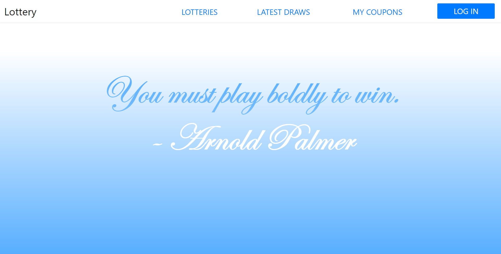

# Lottery
Database systems course project. This project is about conducting a fictional lottery
including backend and frontend side using REST API and Oracle Database.

Main features:
* Communication via REST API.
* Account management.
* Buying lottery coupons.
* Displaying information about latest lotteries.

## Authors

* **Agnieszka Ganowicz**
* **Pawel Cembaluk**

## Built with
* [JetBrains IntelliJ IDEA](https://www.jetbrains.com/idea/)
* [Spring Boot](https://spring.io/)
* [Hibernate](https://hibernate.org/)
* [React](https://reactjs.org/)
* [Oracle Database XE](https://www.oracle.com/database/technologies/appdev/xe.html)
* [Sourcetree](https://www.sourcetreeapp.com/)

## Screenshots

|  |  |
|:------------------------------------:|:---------------------------------:|
|  |  |
|  |  |
|  | |
